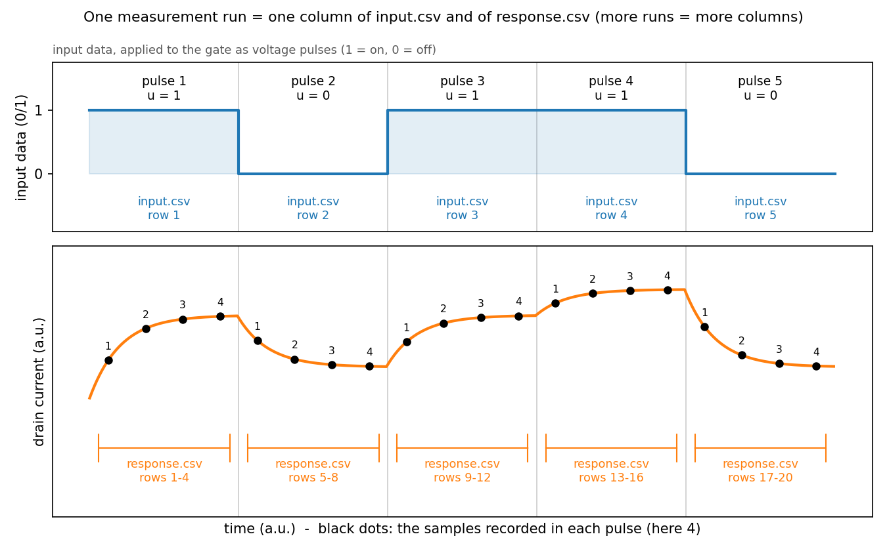

# fefet-reservoir

Physical reservoir computing with ferroelectric (FeFET) and antiferroelectric
(AFeFET) field-effect transistors.

Bring your own device response -- either **measured** from real hardware or
**simulated** with the bundled compact model (a nucleation-limited-switching,
NLS, domain model coupled to a MOSFET) -- and score its short-term memory
(STM) and parity-check (PC) capacity.

## 1. How it works

```
             ┌──────────────────────────────┐
  Path A ──▶ │  your measured device output │ ──┐
 (you own    └──────────────────────────────┘   │
  a device)                                     │     ┌──────────────┐
                                                ├──▶  │  input.csv   │
             ┌──────────────────────────────┐   │     │ response.csv │
  Path B ──▶ │  compact-model simulator     │ ──┘     └──────┬───────┘
 (you don't) │  (simulate-rc)               │                │
             └──────────────────────────────┘                │
                                                     ┌───────▼──────┐
                                                     │   score-rc   │
                                                     │   STM / PC   │
                                                     └───────┬──────┘
                                                             ▼
                                               console summary + saved plots
```

## 2. Install

```bash
git clone https://github.com/GSLee2016/fefet-reservoir.git
cd fefet-reservoir
pip install -e .
```

Requires Python 3.10 or newer. Dependencies: numpy, matplotlib, pyyaml.

## 3. Quickstart

Run the commands from the top folder of the repository.

### Path A -- your measured device

1. **Data**: save `input.csv` and `response.csv` in one folder (section 4).
   `python -m fefet_reservoir suggest <your_data_dir>` shows what it reads from
   them.
2. **Configuration**: copy `configs/template_measured.yaml` (e.g. to
   `configs/my_device.yaml`), set `dataset.path` and every `REVISIT` value.
3. **Run**:
   ```bash
   python -m fefet_reservoir score-rc configs/my_device.yaml
   ```

### Path B -- simulated device

1. **Data**: nothing to prepare -- `simulate-rc` writes `input.csv` and
   `response.csv` for you.
2. **Configuration**: `configs/example_simulated.yaml` (works as is).
3. **Run**:
   ```bash
   python -m fefet_reservoir simulate-rc configs/example_simulated.yaml
   python -m fefet_reservoir score-rc    configs/example_simulated.yaml
   ```
   The example takes about two minutes; if both commands finish and print the
   STM / PC scores, the installation works.

Relative paths inside a configuration file resolve against the folder the
command is run from; `simulate-rc` and `score-rc` print the absolute path of
the data folder they write or read.

## 4. Preparing measured data (path A)

Save two comma-separated files of plain numbers (no header row) in one
folder:

- `input.csv` -- the input data, 0 or 1 per pulse (applied to the gate as
  voltage pulses). One row per pulse, one column per measurement run (a
  "set").
- `response.csv` -- the drain current, in amperes. For each pulse, the
  samples you recorded are stacked in pulse order, so it has (number of
  pulses x samples per pulse) rows; its columns are the same runs as in
  `input.csv`.



`simulate-rc` (path B) writes files of exactly this shape; if in doubt, run
it once and look. When a readout resolution is used (section 6), the
response is treated as a non-negative current in amperes.

## 5. Configuration files

- `configs/template_measured.yaml` (path A) -- the starting point for
  scoring your own measurement; it holds only the `dataset:` section.
- `configs/example_simulated.yaml` (path B) -- simulation and scoring in one
  file, including the device parameters (example values). It lists values
  for both device types (ferroelectric-layer values from Chen et al. 2021):
  it is set up for an antiferroelectric FET, and its comments give the
  ferroelectric alternative. The device type is set by `device:` and
  `t_ratio:`:
  - ferroelectric FET: `device: fefet`, `t_ratio: 0.0` (all domains
    ferroelectric);
  - antiferroelectric FET: `device: afefet`, `t_ratio` = fraction of
    antiferroelectric domains (1.0 = all antiferroelectric; between 0 and 1
    mixes both).

  The two device types also differ in their material values; the comments
  at the top of the example list the full set for each, including
  `dataset.readout_full_scale`.

Each value is explained in the comments of these files. Values that change
the score (washout, train and test sets, ridge_lambda, protocol, readout
settings) must be written in the configuration file; if one is missing or
invalid, the command stops and says what to fix. `max_delay` is 20 if
omitted.

## 6. Scoring

For each delay d = 0 ... `max_delay`, a linear readout (ridge regression) is
fitted on the training sets and tested on the test sets; the score at each
delay is the squared correlation r^2 between prediction and target.

- **STM** -- target: the input d pulses ago.
- **PC** -- target: the parity (sum mod 2) of the current input and the d
  inputs before it.
- **Capacity** = sum of r^2 over d = 1 ... `max_delay` (between 0 and
  `max_delay`). The first `washout` pulses of every set are not scored.

**Protocol** (`dataset.protocol`, required). `kfold`: the sets are shuffled
once (`shuffle_seed`, required with `kfold`), then shifted one place at a
time, once per set; `train_sets` and `test_sets` are applied to the
positions in each shifted order, so every set is tested equally often. The
capacity is the mean over all shifts. `fixed`: one training/test split as
written (no `shuffle_seed`).

**Readout resolution.** Before scoring, the response is read by a
noiseless N-bit converter spanning 0 ... `readout_full_scale`.
`readout_bits` is `auto`, a whole number of bits (1-24), or `ideal` (no
quantization). `auto` picks N from the time between samples of one pulse:

| Sample interval | Bits |
| --- | --- |
| 1 ms or longer | 16 |
| 1 us to < 1 ms | 12 |
| 100 ns to < 1 us | 10 |
| shorter than 100 ns | 8 |

For simulated data, `physics.device_noise` adds device noise as a fraction
of the read current (0 = none).

## 7. Output

`score-rc` prints the two capacities together with every setting that
determined them, and saves `rc_delay_curves.png` and `rc_summary_bar.png` to
`<dataset.path>/scores/` (change with `--out`).

## 8. License and related work

Released under the MIT License -- see `LICENSE`.

This code was used in the following work:

- G. Lee, C. Kang, S. Kim, Y. Park, E. J. Shin, and B. J. Cho, "Physical
  Reservoir Based on a Leaky-FeFET Using the Temporal Memory Effect," *IEEE
  Electron Device Letters*, vol. 45, no. 1, pp. 108-111, Jan. 2024,
  doi: 10.1109/LED.2023.3335142.
- G. Lee, "Neuron Devices using Ferroelectric-based FET and Its Neuromorphic
  Applications," Ph.D. dissertation, KAIST, 2023.

The device simulator implements the NLS domain model of Deng et al.
(2020), extended to antiferroelectric domains following Chen et al. (2021),
coupled to a surface-potential (charge-sheet) MOSFET model (Tsividis &
McAndrew); the example ferroelectric-layer values are from Chen et al.
(2021). The MOSFET model is a long-channel model: it is intended for
channel lengths of about a micrometre or more, such as the 10 µm channel of
the example.

## References

- S. Deng, G. Yin, W. Chakraborty, S. Dutta, S. Datta, X. Li, K. Ni, "A
  Comprehensive Model for Ferroelectric FET Capturing the Key Behaviors:
  Scalability, Variation, Stochasticity, and Accumulation," *2020 IEEE
  Symposium on VLSI Technology*, doi:10.1109/VLSITechnology18217.2020.9265014.
- Y.-C. Chen, K.-Y. Hsiang, Y.-T. Tang, M.-H. Lee, P. Su, "NLS based Modeling
  and Characterization of Switching Dynamics for Antiferroelectric/
  Ferroelectric Hafnium Zirconium Oxides," *2021 IEEE International Electron
  Devices Meeting (IEDM)*, doi:10.1109/IEDM19574.2021.9720645.
- Y. Tsividis and C. McAndrew, *Operation and Modeling of the MOS
  Transistor*, 3rd ed., Oxford University Press, 2011.
- S. M. Sze and K. K. Ng, *Physics of Semiconductor Devices*, 3rd ed., Wiley,
  2007.
- P. Misiakos and D. Tsamakis, "Accurate measurements of the silicon
  intrinsic carrier density from 78 to 340 K," *J. Appl. Phys.* 74, 3293
  (1993).
